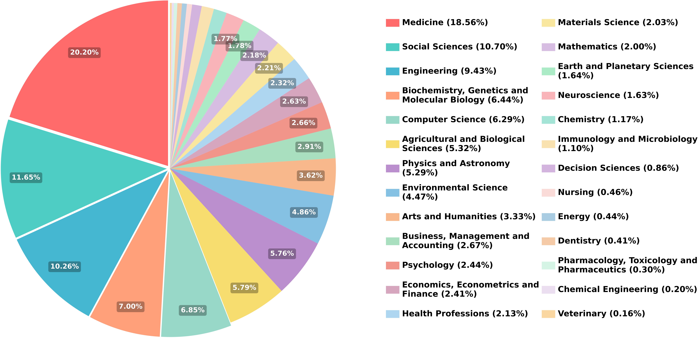
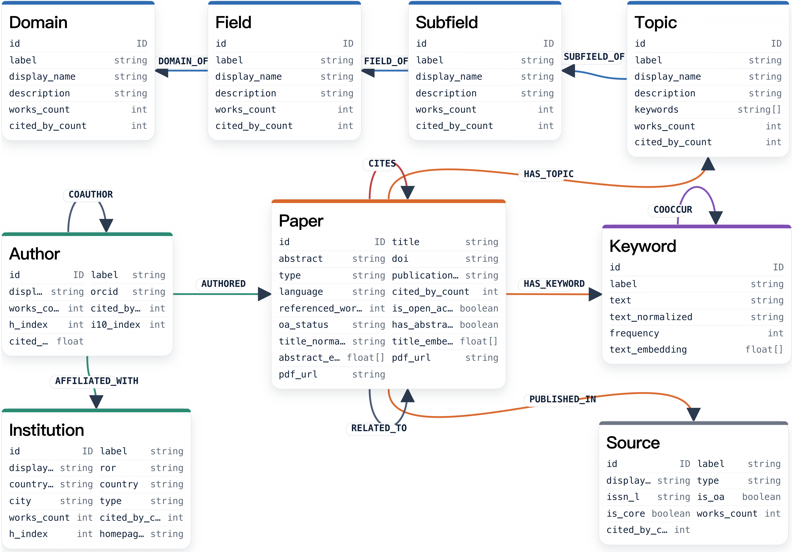

<div align="center">
  <h1>SciNet: 面向自动化科学研究的大规模知识图谱</h1>
</div>

<p align="center">
  🌐 <a href="README.md">English</a> · <strong>简体中文</strong>
</p>

<p align="center">
  <a href="docs/api/SCINET_API_DOC_zh.html">📚 API 文档站</a>
</p>

<p align="center">
  一个可通过 pip 安装的 SciNet 客户端与命令行工具，用于调用托管 SciNet API 完成文献驱动的科研工作流。
</p>

<p align="center">
  <a href="https://arxiv.org/abs/2602.14367">📄 arXiv</a>
  ·
  <a href="http://scinet.openkg.cn/register">🔑 获取 API Token</a>
  ·
  <a href="http://scinet.openkg.cn/healthz">🩺 API 健康检查</a>
</p>

---

## ✨ 项目概览

你可以把 SciNet 理解成一张面向科研的“知识地图”。输入一个研究主题、一个 idea、一位作者，或一条论文线索，SciNet 会帮你检索相关文献、沿着知识图谱寻找证据，并把结果整理成易读报告和可复现的 JSON 产物。

这张图谱不只是论文列表。它把论文、作者、机构、期刊会议、关键词、引用关系，以及从 Domain 到 Topic 的四级学科体系连接起来。因此，SciNet 的检索不只是在匹配关键词，也可以顺着研究领域、概念、人物和论文之间的关系继续探索。

本仓库提供的是面向用户的轻量级 **SciNet 客户端包**。新用户只需要通过 `pip` 安装、注册 API Token，就可以在本地运行文献检索和科研工作流；无需自己部署 Neo4j、维护图数据库，也不用关心后端基础设施。

<p align="center">
  
</p>

<p align="center">
  <em>SciNet 覆盖医学、社会科学、工程、计算机科学、材料科学、数学等多个学科领域，适合跨学科科研探索。</em>
</p>

<p align="center">
  
</p>

<p align="center">
  <em>图谱把论文与作者、机构、来源、关键词、引用、相关工作，以及 Domain-Field-Subfield-Topic 层级连接起来。</em>
</p>

通过这个客户端，你可以：

- 使用关键词、语义、标题、参考文献和图检索能力查找论文；
- 运行文献综述、idea grounding、idea evaluation、idea generation、趋势分析、相关作者检索和研究者画像等科研工作流；
- 保存 `request.json`、`response.json`、`summary.txt`、`report.md` 等可复现实验产物；
- 通过可编辑 CLI **skills** 定制自己的下游科研流程。

---

## 📑 目录

- [✨ 项目概览](#-项目概览)
- [🚀 快速开始](#-快速开始)
- [🔑 API Token](#-api-token)
- [🧠 SciNet 能做什么](#-scinet-能做什么)
- [🧩 支持任务](#-支持任务)
- [🛠️ CLI 优先工作流](#-cli-优先工作流)
- [🧰 可编辑 Skills](#-可编辑-skills)
- [🐍 Python SDK](#-python-sdk)
- [⚙️ 配置说明](#-配置说明)
- [🧪 示例命令](#-示例命令)
- [📦 输出与运行产物](#-输出与运行产物)
- [🛠️ PDF 工作流中的 GROBID](#-pdf-工作流中的-grobid)
- [📂 仓库结构](#-仓库结构)
- [🧯 常见问题](#-常见问题)
- [🗺️ Roadmap](#-roadmap)
- [✍️ Citation](#-citation)
- [📄 License](#-license)

---

## 🚀 快速开始
### 1. 安装

从 GitHub 直接安装：
```bash
pip install "git+https://github.com/zjunlp/SciNet.git#subdirectory=scinet"
```

如果只希望隔离安装 CLI：
```bash
pipx install "git+https://github.com/zjunlp/SciNet.git#subdirectory=scinet"
```

安装后检查：

```bash
scinet -h
```

### 2. 注册 API Token

访问：
```text
http://scinet.openkg.cn/register
```

完成邮箱验证码注册，并复制个人 Token。
### 3. 配置

Linux / macOS：
```bash
export SCINET_API_BASE_URL="http://scinet.openkg.cn"
export SCINET_API_KEY="your-personal-scinet-token"
```

Windows CMD：
```bat
set SCINET_API_BASE_URL=http://scinet.openkg.cn
set SCINET_API_KEY=your-personal-scinet-token
```

### 4. 测试

```bash
scinet health
scinet config
```

### 5. 运行论文检索
```bash
scinet search-papers \
  --query "open world agent" \
  --keyword "high:open world agent" \
  --top-k 3
```

---

## 🔑 API Token

SciNet 对公开用户使用个人 API Token。

### 浏览器注册

访问：
```text
http://scinet.openkg.cn/register
```

流程：

1. 输入姓名、邮箱、机构和使用目的；
2. 点击 **Send code**；
3. 查收邮箱验证码；
4. 输入验证码并创建 Token；
5. 复制返回的 `scinet_xxx` Token。

Token 只显示一次，请妥善保存。

### 查询 Token 状态
```bash
curl -H "Authorization: Bearer $SCINET_API_KEY" \
  http://scinet.openkg.cn/v1/auth/token/status
```

### 查询用量

```bash
curl -H "Authorization: Bearer $SCINET_API_KEY" \
  "http://scinet.openkg.cn/v1/auth/usage?days=7"
```

---

## 🧠 SciNet 能做什么

SciNet 面向科研任务，而不只是普通关键词检索。

1. **Search + KG Retrieval**：基于关键词、语义、标题锚点、参考文献和图传播检索相关论文。
2. **科研工作流自动化**：支持文献综述、idea grounding、idea evaluation、idea generation、趋势分析、相关作者检索和研究者画像。
3. **Agent 友好的输出**：每次运行都会保留机器可读 JSON 产物和面向用户的 Markdown 报告。
4. **可编辑 Skills**：常用下游任务可以封装为 JSON skill，用户可查看、复制、修改并通过 CLI 一键运行。

---

## 🧩 支持任务

| 命令 | 场景 | 主要输出 |
|---|---|---|
| `scinet search-papers` | 论文检索 | 相关论文和 Markdown 报告 |
| `scinet related-authors` | 相关作者发现 | 候选作者与分数 |
| `scinet author-papers` | 作者论文查询 | 指定作者论文 |
| `scinet support-papers` | 支撑论文检索 | 候选作者的相关证据论文 |
| `scinet paper-search` | 轻量底层论文检索 | 快速论文候选 |
| `scinet literature-review` | 文献综述 | 核心论文池、时间线、写作提示 |
| `scinet idea-grounding` | idea 定位 | 相似工作和差异化证据 |
| `scinet idea-evaluate` | idea 评估 | 新颖性、可行性、可靠性证据 |
| `scinet idea-generate` | idea 生成 | 主题组合和 idea seeds |
| `scinet trend-report` | 趋势分析 | 发展脉络和代表工作 |
| `scinet researcher-review` | 研究者背景综述 | 研究轨迹与代表论文 |
| `scinet skill` | 可编辑 skill 注册表 | 可复用工作流预设 |

---

## 🛠️ CLI 优先工作流

SciNet 以 CLI 为优先界面，方便用户和 AI Agent 调用。

```bash
scinet -h
scinet search-papers -h
scinet literature-review -h
scinet skill -h
```

基础检索：

```bash
scinet search-papers \
  --query "open world agent" \
  --domain "artificial intelligence" \
  --time-range 2020-2024 \
  --keyword "high:open world agent" \
  --top-k 3 \
  --top-keywords 0 \
  --max-titles 0 \
  --max-refs 0
```

### 检索模式
| 模式 | 含义 | 适用场景 |
|---|---|---|
| `keyword` | 关键词驱动 KG 检索 | 术语明确 |
| `semantic` | 语义检索 | 宽泛语义匹配 |
| `title` | 标题锚点检索 | 已知代表论文 |
| `hybrid` | 关键词 + 语义 + 标题 + 图游走 | 默认推荐 |

未指定 `--retrieval-mode` 时，默认使用 `hybrid`。
### 专家锚点

```bash
--keyword "high:open world agent"
--title "middle:Voyager: An Open-Ended Embodied Agent with Large Language Models"
--reference "low:JARVIS-1: Open-World Multi-task Agents with Memory-Augmented Multimodal Language Models"
```

### 图检索偏好
| 参数 | 含义 |
|---|---|
| `--bias-keyword` | 关键词路径强度 |
| `--bias-non-seed-keyword` | 非种子关键词扩展 |
| `--bias-citation` | 引用边强度 |
| `--bias-related` | 论文相关边强度 |
| `--bias-authorship` | 作者-论文关系强度 |
| `--bias-coauthorship` | 合作者网络强度 |
| `--bias-cooccurrence` | 关键词共现强度 |
| `--bias-exploration` | 图探索程度 |
| `--ranking-profile` | 排序偏好：`precision`、`balanced`、`discovery`、`impact` |

---

## 🧰 可编辑 Skills

SciNet skills 是下游科研工作流的 JSON 预设，方便用户查看、复用和自定义。
```bash
scinet skill list
scinet skill show literature-review
scinet skill run literature-review --query "open world agent" --keyword "high:open world agent"
scinet skill run --dry-run literature-review --query "open world agent" --keyword "high:open world agent"
```

创建自定义 skill：
```bash
scinet skill init my-review --from literature-review
```

它会生成：
```text
./skills/my-review.json
```

用户可以直接修改 JSON，然后运行：

```bash
scinet skill run my-review --query "your topic"
```

---

## 🐍 Python SDK

```python
from scinet import SciNetClient

client = SciNetClient()
print(client.health())

result = client.search_papers(
    query="open world agent",
    keywords=[{"text": "open world agent", "score": 10}],
    top_k=3,
)
print(result)
```

也可以直接传入配置：

```python
client = SciNetClient(
    base_url="http://scinet.openkg.cn",
    api_key="your-personal-scinet-token",
)
```

---

## ⚙️ 配置说明

```env
SCINET_API_BASE_URL=http://scinet.openkg.cn
SCINET_API_KEY=your-personal-scinet-token
SCINET_TIMEOUT=900
SCINET_RUNS_DIR=./runs
```

兼容旧变量：

```env
KG2API_BASE_URL=http://scinet.openkg.cn
KG2API_API_KEY=your-personal-scinet-token
```

新用户推荐使用 `SCINET_*`。

---

## 🧪 示例命令

### 文献综述

```bash
scinet literature-review \
  --query "retrieval augmented generation" \
  --domain "artificial intelligence" \
  --time-range 2020-2025 \
  --keyword "high:retrieval augmented generation" \
  --top-k 5
```

### Idea Evaluation

```bash
scinet idea-evaluate \
  --idea "LLM-based multi-perspective evaluation for scientific research ideas" \
  --domain "artificial intelligence" \
  --time-range 2020-2025 \
  --keyword "high:idea evaluation" \
  --keyword "middle:LLM as a judge" \
  --top-k 3
```

### Trend Report

```bash
scinet trend-report \
  --query "retrieval augmented generation" \
  --domain "artificial intelligence" \
  --time-range 2020-2025 \
  --keyword "high:retrieval augmented generation" \
  --top-k 5
```

---

## 📦 输出与运行产物
终端默认输出简洁表格，完整结果保存在：

```text
runs/<run_id>/
```

常见文件：
| 文件 | 说明 |
|---|---|
| `plan.json` | 结构化检索计划 |
| `request.json` | 发送给 SciNet API 的完整请求 |
| `response.json` | 后端原始响应 |
| `summary.txt` | 简短摘要 |
| `report.md` | 面向用户的 Markdown 报告 |
| `metadata.json` | 运行元信息 |

---

## 🛠️ PDF 工作流中的 GROBID

GROBID 用于从科研 PDF 中抽取标题、作者、摘要和参考文献等结构化信息，只在 PDF 输入工作流中需要。
```bash
docker pull lfoppiano/grobid:latest
docker run -d --rm --name grobid -p 8070:8070 lfoppiano/grobid:latest
curl http://127.0.0.1:8070/api/isalive
```

配置：
```env
GROBID_BASE_URL=http://127.0.0.1:8070
```

---

## 📂 仓库结构

```text
SciNet/
  pyproject.toml
  README.md
  README_zh.md
  README_skills.md
  .env.example
  src/
    scinet/
      __init__.py
      cli.py
      client.py
      config.py
      skills.py
      builtin_skills.json
  examples/
    search_papers.sh
    literature_review.sh
    idea_evaluate.sh
  tests/
    test_import.py
  references/
    search/
```

---

## 🧯 常见问题

### `scinet health` 成功，但 `search-papers` 返回 401

说明 Token 缺失或无效。
```bash
echo $SCINET_API_KEY
export SCINET_API_KEY="your-personal-scinet-token"
```

Windows CMD：
```bat
set SCINET_API_KEY=your-personal-scinet-token
```

### 没有收到邮箱验证码

请检查邮箱地址、垃圾邮件和验证码重发间隔。

### 检索很慢或超时

使用轻量参数：
```bash
--top-k 3
--top-keywords 0
--max-titles 0
--max-refs 0
--bias-exploration low
```

### Windows 上找不到 `scinet` 命令

```bat
.venv\Scripts\scinet.exe -h
```

或重新安装：

```bat
.venv\Scripts\python.exe -m pip install -e .
```

---

## 🗺️ Roadmap

- [ ] 发布 PyPI 包，支持 `pip install scinet-client`
- [ ] 增加 `scinet auth login/status/usage`
- [ ] 增加更多内置 agent skills
- [ ] 支持 Token 重置和吊销
- [ ] API Playground
- [ ] MCP / Agent Runtime 集成
- [ ] 扩展论文之外的知识类型，如数据集、代码、标准、定理和实验经验
- [ ] 建立面向科学研究任务的评测基准
- [ ] 更系统的动态知识更新机制

---

## ✍️ Citation

如果 SciNet 对你的研究有帮助，请引用：
```bibtex
@article{scinet2026,
  title={SciNet: A Large-Scale Knowledge Graph for Automated Scientific Research},
  author={SciNet Team},
  journal={arXiv preprint arXiv:2602.14367},
  year={2026}
}
```

---

## 📄 License

本项目采用 MIT License。详见 [LICENSE](LICENSE)。
